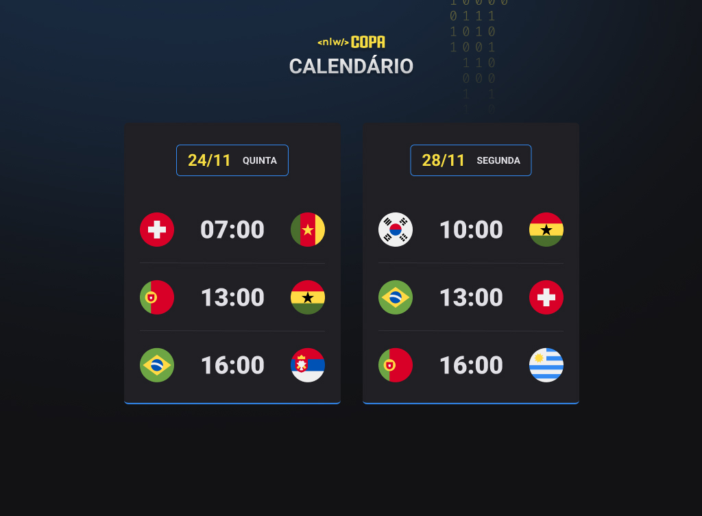

 <h1 align="center"> NLW - COPA </h1>

  <a href="#-sobre-o-projeto">Projeto</a>&nbsp;&nbsp;&nbsp;|&nbsp;&nbsp;&nbsp;
  <a href="#-tecnologias">Tecnologias</a>&nbsp;&nbsp;&nbsp;|&nbsp;&nbsp;&nbsp;
  <a href="#memo-licença">Licença</a>

  

Você pode acessá-lo com este [link.](https://copa-ten.vercel.app/)

---

## 💻 Sobre o Projeto

O Calendário da Copa é um projeto que mostra os jogos da Copa do Mundo de 2022, utilizando um Javascript dinâmico através da DOM

Alguns features existentes são:

- Fácil implementação de um novo card ou jogo;
- Responsividade para todos dispositivos;

Você pode acessá-lo com este [link.](https://copa-ten.vercel.app/)

--

## 🚀 Tecnologias

Esse projeto foi desenvolvido com as seguintes tecnologias:

- HTML5 e CSS3
- JavaScript
- [Figma](https://www.figma.com/file/eV90XQCnjnBjZX66TaJ8lY/Calend%C3%A1rio-de-Jogos-(Community)?node-id=0%3A1)

## :memo: Licença

Esse projeto está sob a licença MIT.

---

Desenvolvido com 💛 por Renan Melo 👁️‍🗨️
